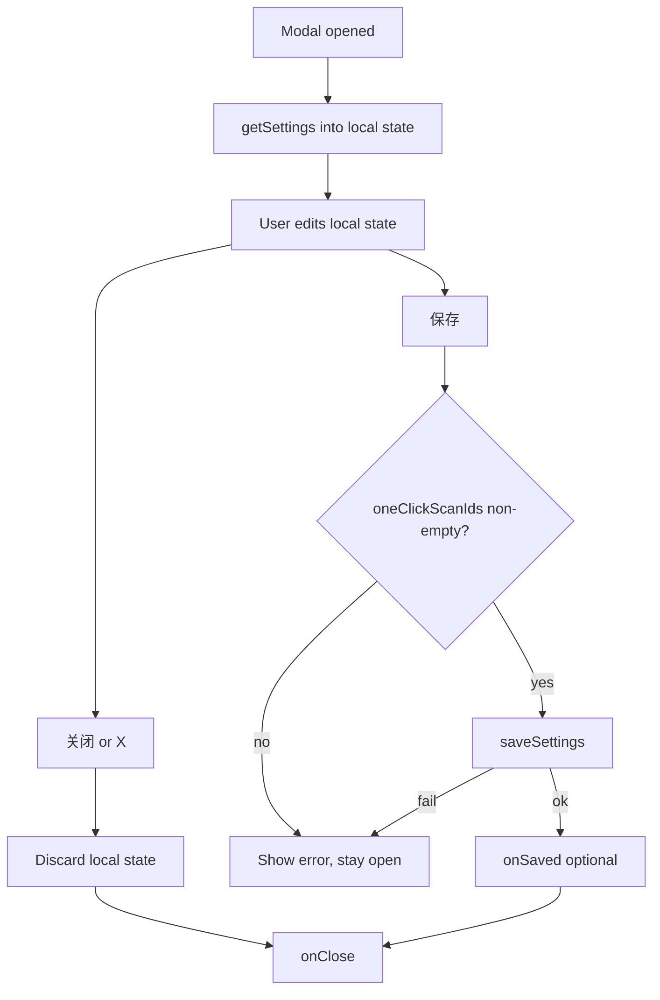

# Settings Panel & Duplicates Scan Guard Design

**Status:** Approved (brainstorming, 2026-05-31)  
**Scope:** Settings modal layout, save/close behavior, and blocked duplicates scan when disabled in settings.

## Summary

Improve the scan settings modal so labels align horizontally with inputs, saving closes the modal, and closing (footer button or title-bar X) discards unsaved edits. When「扫描重复文件」is off in settings, tapping scan on the duplicates category shows an informational modal instead of starting a scan.

## Decisions

| Topic | Choice |
|-------|--------|
| Form layout | Label and control on one row (`Grid` / shared row component) |
| Save | Persist settings, then close modal on success |
| Close without save | Footer「关闭」and top-right X both discard local edits |
| Title bar | `withCloseButton` enabled (close icon) |
| Duplicates scan when disabled | Block scan; modal explains;「去设置」opens settings (no scan) |
| Implementation | Extend existing `ScanConfirmModal` + `SettingsPanel` (approach 1) |

## Settings Modal UI

### `SettingsFieldRow` component

- Location: `src/components/SettingsFieldRow.tsx` (or colocated in `SettingsPanel.tsx` if kept small).
- Layout: Mantine `Grid` — label column (~5/12) + control column (~7/12), `align="center"`.
- `FieldLabel` (text + optional tooltip icon) stays in the label column.
- Apply to:
  - 大文件阈值（MB） — `NumberInput`
  - 重复文件最小大小（MB） — `NumberInput`
  - 扫描重复文件 — `Switch`
  - 重复文件哈希上限（MB） — `NumberInput`
  - 扫描 node_modules 目录 — `Switch`

### Dependent fields

When `scanDuplicates === false`:

- Disable「重复文件最小大小」and「重复文件哈希上限」inputs.
- Visual: reduced opacity or Mantine `disabled` styling.

### One-click scan section

- Section title + helper text unchanged.
- `Checkbox` list per `SCANNER_ORDER` — full-width rows (category name as label).

### Modal chrome

- `withCloseButton: true` on settings `Modal` (do not use `cleanMacModalProps` here if it forces `withCloseButton: false`).
- Title:「扫描设置」.
- Footer: `Group justify="flex-end"` —「关闭」(default) +「保存」(primary, loading while saving).

## Save / Close Behavior



- Remove inline「已保存，下次扫描生效」success text (closing modal is sufficient feedback).
- Keep inline error text on validation or API failure.

## Duplicates Scan Guard (frontend)

### Trigger

In `useDetailView.handleScanCategory` (or equivalent single entry for category scan):

```
if (scannerId === "duplicates" && appSettings && !appSettings.scanDuplicates) {
  setDuplicatesDisabledModalOpen(true)
  return
}
```

Requires `appSettings: AppSettings | null` passed into `useDetailView` from `App.tsx`.

### Modal

Reuse `ScanConfirmModal` with extended props:

| Prop | Purpose |
|------|---------|
| `copy` | title / body / confirmLabel |
| `onConfirm` |「去设置」— close confirm modal, call `onOpenSettings()` |
| `onClose` |「取消」— dismiss only |

Suggested copy:

- **title:** 重复文件扫描已关闭
- **body:** 请在「扫描设置」中开启「扫描重复文件」后再扫描。
- **confirmLabel:** 去设置
- Cancel button label: 取消 (existing)

`App.tsx` wires `onOpenSettings={() => setSettingsOpen(true)}`.

### Backend fallback

Keep `DuplicatesScanner` early return when `!scan_duplicates` (empty result + warning). Frontend guard prevents unnecessary scan in normal UX.

## Files to Touch (implementation reference)

| File | Change |
|------|--------|
| `src/components/SettingsPanel.tsx` | Row layout, save→close, withCloseButton |
| `src/components/SettingsFieldRow.tsx` | New row wrapper (optional extract) |
| `src/components/ScanConfirmModal.tsx` | Optional `cancelLabel` / `onOpenSettings` pattern if needed |
| `src/lib/slowScanConfirmCopy.ts` or new `scanGuardCopy.ts` | Duplicates-disabled copy constant |
| `src/hooks/useDetailView.ts` | Guard + modal state |
| `src/App.tsx` | Pass `appSettings`, wire duplicates modal + open settings |

## Testing

| Case | Expected |
|------|----------|
| Save valid settings | Modal closes; `onSaved` receives new settings |
| Close / X with edits | Modal closes; reopen shows server values (edits lost) |
| Save with zero one-click categories | Error shown; modal stays open |
| `scanDuplicates` off, scan duplicates card | Confirm modal; no `startScan` |
|「去设置」| Settings modal opens |
| `scanDuplicates` on | Normal scan flow (no duplicates-disabled modal) |

## Out of Scope

- Unsaved-changes confirm dialog on close (user chose discard-on-close).
- Auto-enabling `scanDuplicates` from the guard modal.
- Changing default `scanDuplicates` value in Rust settings.

## Implementation Follow-up

After spec review, use the writing-plans skill for a step-by-step implementation plan.
