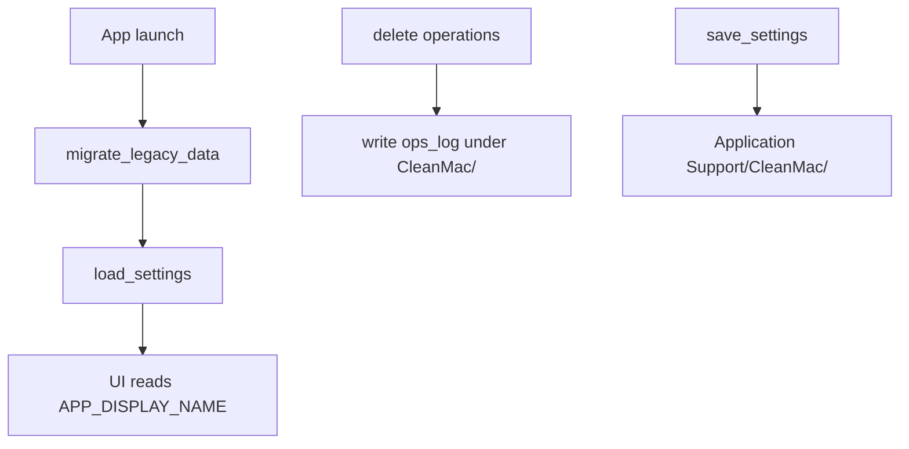

# CleanMac Rename Design

**Status:** Approved (brainstorming, 2026-05-31)  
**Scope:** Full rebrand from 磁盘助手 to CleanMac (option C) with legacy data migration (option A).

## Summary

Rename the macOS app from **磁盘助手** to **CleanMac** in a single atomic release. Update user-visible strings, Tauri bundle identity, on-disk paths, internal code identifiers, and documentation. On first launch after upgrade, copy legacy settings and operation logs from old paths when new paths do not exist yet. Users must re-grant Full Disk Access because the Bundle ID changes.

## Decisions

| Topic | Choice |
|-------|--------|
| Rename depth | Full (UI + runtime paths + Bundle ID + code symbols) |
| Display name | **CleanMac** |
| Legacy data | One-time copy migration on first launch |
| Implementation style | Single release + centralized identity constants (approach 3) |

## Identity Mapping

| Dimension | Before | After |
|-----------|--------|-------|
| User-visible name | 磁盘助手 | **CleanMac** |
| Bundle ID | `com.canglang.diskcleaner` | `com.canglang.cleanmac` |
| Cargo package | `disk-cleaner-desktop` | `cleanmac-desktop` |
| Application Support dir | `~/Library/Application Support/磁盘助手/` | `~/Library/Application Support/CleanMac/` |
| Logs dir | `~/Library/Logs/磁盘助手/` | `~/Library/Logs/CleanMac/` |
| npm package name (`package.json`) | `cleanmac` | unchanged |

### Out of scope

- Functional copy containing 磁盘 as a word (e.g. 磁盘空间, 完全磁盘访问权限, 虚拟机磁盘 file category).
- GitHub repo name (already `cleanMac`).
- App icons and visual branding beyond name strings.

## Architecture

### Centralized constants

**Rust** — Add `src-tauri/src/app_identity.rs` (or top-level exports in a dedicated module):

- `PRODUCT_NAME`: `"CleanMac"`
- `LEGACY_APP_NAME`: `"磁盘助手"`
- Path helpers: `settings_dir()`, `logs_dir()`, `legacy_settings_path()`, `legacy_log_path()`

`settings.rs` and `ops_log.rs` consume these helpers instead of local string literals.

**Frontend** — Add `src/lib/appIdentity.ts`:

- `APP_DISPLAY_NAME = "CleanMac"`
- Used by `MacWindowTitleBar.tsx`, and aligned with `index.html` / Tauri window title.

### Configuration surfaces

| File | Fields to update |
|------|------------------|
| `src-tauri/tauri.conf.json` | `productName`, `identifier`, window `title` |
| `src-tauri/Cargo.toml` | `name`, `description` |
| `index.html` | `<title>` |
| `src-tauri/capabilities/default.json` | `description` |
| `README.md`, `CONTRIBUTING.md` | App name table, bilingual intro (drop 磁盘助手 subtitle) |

Regenerated `src-tauri/gen/schemas/capabilities.json` updates when Tauri rebuilds from source capabilities.

### Frontend symbol renames

| Old | New |
|-----|-----|
| `diskCleanerTheme.ts` / `diskCleanerTheme` | `cleanMacTheme.ts` / `cleanMacTheme` |
| `diskCleanerModalProps.ts` / `diskCleanerModalProps` | `cleanMacModalProps.ts` / `cleanMacModalProps` |

Update all imports in components and `main.tsx`. Comments referencing "disk-cleaner" should say CleanMac.

## Legacy migration

### Trigger

Run once during app startup in `lib.rs` setup, before settings load or log writes, via `migrate_legacy_data()`.

### Rules

1. **Settings:** If new `…/Application Support/CleanMac/settings.json` does not exist and legacy `…/磁盘助手/settings.json` exists → create parent dirs, copy file to new location. Do not delete legacy files.
2. **Operations log:** If new `…/Logs/CleanMac/operations.log` does not exist and legacy log exists → create parent dirs, copy file to new location.
3. **Idempotent:** If new path already exists, skip that item.
4. **Errors:** Log to stderr; do not abort startup. App continues with defaults if load still fails.

### Not migrated

- macOS TCC / Full Disk Access entries (new Bundle ID = new app to the system).
- Legacy directories after copy (user may delete manually).

### User-facing note (release / README)

After upgrading from 磁盘助手: settings migrate automatically; re-enable Full Disk Access for CleanMac in System Settings → Privacy & Security.

## Data flow

## Error handling

- Migration I/O failures: non-fatal, stderr only.
- Missing legacy data: no-op (fresh install path).
- Partial copy: prefer atomic copy (write temp + rename) if implemented; minimum bar is `fs::copy` with error logging.

## Testing

| Area | Tests |
|------|-------|
| Migration | Rust unit tests with `tempfile`: legacy-only → new file exists; new exists → skip; neither → skip |
| Settings | Existing round-trip test uses `PRODUCT_NAME` path under mocked HOME |
| Build | `pnpm test`, `cargo test --manifest-path src-tauri/Cargo.toml` |
| Manual | `pnpm tauri:build`: `.app` name CleanMac; dev machine with old 磁盘助手 settings → settings preserved |

## Release notes (template)

- App renamed to **CleanMac** (formerly 磁盘助手).
- Settings and operation logs migrate on first launch.
- Re-grant **Full Disk Access** for the new app in System Settings.
- Optional: remove old `磁盘助手` folders under Application Support and Logs.

## Alternatives considered

| Approach | Verdict |
|----------|---------|
| Two-phase release (UI first, ID later) | Rejected — conflicts with full rename goal |
| No migration | Rejected — user chose A |
| Read-fallback without copy | Rejected — user chose one-time migration |

## Implementation follow-up

After this spec is reviewed and approved, create an implementation plan via the writing-plans skill. No code changes until that plan is executed.
